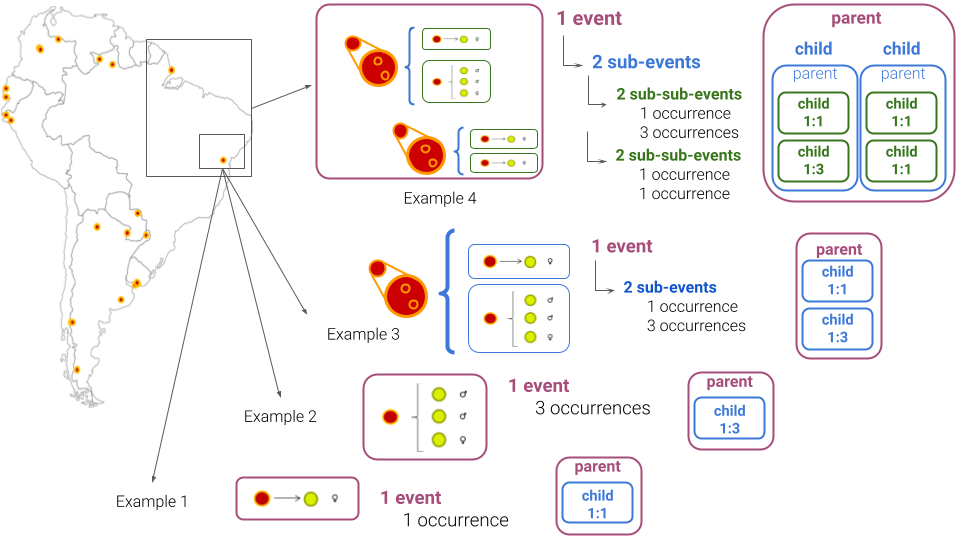
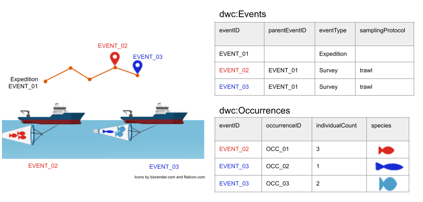
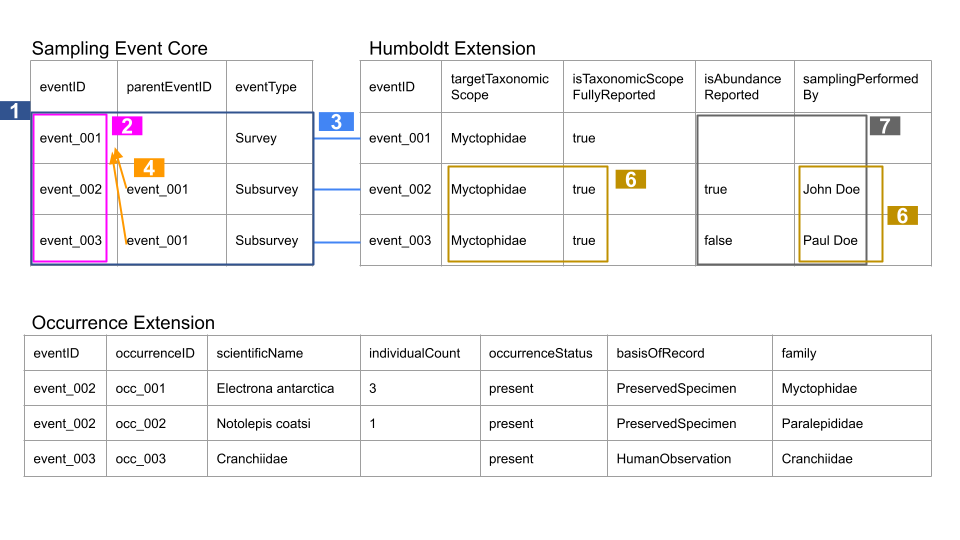

# Properties of hierarchical events in the Humboldt Extension for Ecological Inventories

Title
: Properties of hierarchical events in the Humboldt Extension for Ecological Inventories

Date version issued
: 2023-08-25

Date created
: 2023-08-25

Part of TDWG Standard
: <http://www.tdwg.org/standards/450>

This version
: <http://rs.tdwg.org/dwc/doc/hierarchy/2023-08-25>

Latest version
: <http://rs.tdwg.org/dwc/doc/hierarchy/>

Abstract
: Ecological inventories in the context of Darwin Core can be considered as types of dwc:Events with the potential for hierarchical structure relating broader parent dwc:Events with narrower child dwc:Events. Terms in the Humboldt Extension are all properties of a dwc:Event. This document explains how dwc:Event hierarchies for ecological inventories should be structured and provides guidance on the use of Humboldt Extension terms in the context of parent and child dwc:Events.

Contributors
: [Yi-Ming Gan](https://orcid.org/0000-0001-7087-2646) ([Royal Belgian Institute of Natural Sciences](http://www.wikidata.org/entity/Q16665660)), [Wesley M. Hochachka](https://orcid.org/0000-0002-0595-7827) ([Cornell Lab of Ornithology](http://www.wikidata.org/entity/Q2997535)), [John Wieczorek](https://orcid.org/0000-0003-1144-0290) ([VertNet](http://www.wikidata.org/entity/Q98382028)), [Yanina V. Sica](https://orcid.org/0000-0002-1720-0127) ([Yale University](http://www.wikidata.org/entity/Q49112)), [Peter Brenton](https://orcid.org/0000-0001-9730-8340) ([Atlas of Living Australia, CSIRO](http://www.wikidata.org/entity/Q16335177)), [Robert D. Stevenson](https://orcid.org/0000-0003-1617-5895) ([Department of Biology, University of Massachusetts Boston](http://www.wikidata.org/entity/Q15144)), [Anahita J. N. Kazem](https://orcid.org/0000-0003-2475-132X) ([German Centre for Integrative Biodiversity Research, Leipzig and Friedrich Schiller University, Jena](http://www.wikidata.org/entity/Q1206134)), [Steven J. Baskauf](https://orcid.org/0000-0003-4365-3135) ([Vanderbilt University Libraries](http://www.wikidata.org/entity/Q16849893)), [Zachary R. Kachian](https://orcid.org/0000-0002-0500-0339) ([Keller Science Action Center, Field Museum of Natural History](http://www.wikidata.org/entity/Q1122595)), [Kate Ingenloff](https://orcid.org/0000-0001-5942-9053) ([Global Biodiversity Information Facility (GBIF)](http://www.wikidata.org/entity/Q1531570))

Creator
: TDWG Humboldt Extension Task Group

Bibliographic citation
: TDWG Humboldt Extension Task Group. 2023. Properties of hierarchical events in the Humboldt Extension for Ecological Inventories. Biodiversity Information Standards (TDWG). <http://rs.tdwg.org/dwc/doc/hierarchy/2023-08-25>

## 1 Introduction (non-normative)

### 1.1 Status of the content of this document

Section 3 of this document is normative, serving as official guidelines
in application of the Humboldt Extension. The other sections are
non-normative and designed to help improve overall understanding in
application and interpretation of the Extension.

### 1.2 RFC 2119 keywords
---------------------

The key words "MUST", "MUST NOT", "REQUIRED", "SHALL", "SHALL NOT", "SHOULD", 
"SHOULD NOT", "RECOMMENDED", "MAY", and "OPTIONAL" in this document are to 
be interpreted as described in [BCP 14](https://datatracker.ietf.org/doc/html/bcp14)
\[[[RFC2119]](https://datatracker.ietf.org/doc/html/rfc2119)\]
\[[[RFC8174]](https://datatracker.ietf.org/doc/html/rfc8174)\]
when, and only when, they are written in capitals (as shown here).

## 1.3 Namespaces and terminology

The namespace 'eco:' abbreviates terms minted for the Humboldt Extension
for ecological inventories
([http://rs.tdwg.org/eco/terms/](http://rs.tdwg.org/eco/terms/)).
'dwc:' abbreviates terms from the main Darwin Core vocabulary namespace
([http://rs.tdwg.org/dwc/terms/](http://rs.tdwg.org/dwc/terms/)).

Words in code markup are term IRIs or literal values. The word
"organism" is used colloquially and is not used in the technical sense
of the dwc:Organism class, unless specifically presented as
"dwc:Organism." The word "Event" is used in the technical sense of the
dwc:Event class. "Humboldt Extension" is an abbreviation for the
"Humboldt Extension for Ecological Inventories."

### 1.4 Intended audience and use for this document

The information in this document is targeted at data providers, data
aggregators, and data consumers. *Data providers* are the individuals
responsible for mapping ecological inventory data into an Event-based
[Darwin Core
Archive](https://ipt.gbif.org/manual/en/ipt/latest/dwca-guide)
format that includes the Humboldt Extension. *Data aggregators* and
*data consumers* can use this document to better understand the data
shared by data providers, specifically with respect to the
**relationships between hierarchical dwc:Event levels** and **when it is
or is not appropriate to make inferences** about attributes such as
abundance or absence of detection.

## 2 Rationale (non-normative)

Ecological inventories in the context of Darwin Core can be considered
as types of [dwc:Events](https://dwc.tdwg.org/list/#dwc_Event)
--- they are actions that occur at specific locations over defined
periods of time. The terms in the Humboldt Extension are all properties
of a dwc:Event.

There are many types of ecological inventory, ranging from singular
observations of individual taxa (1 event:1 observation; Example 1 in
Figure 1) to highly structured and deeply nested observations within
other observations (e.g., 1 event:2 sub-events, each sub-event:2
sub-sub-events; Example 4 in Figure 1). The need for guidance on **how
to capture the details of nested observations** (dwc:Event hierarchies)
is the rationale for this document. Nested sampling designs can be
translated into a relational database schema of parent-child dwc:Event
relationships (a parent event with one or more child sub-events; Figure
1). This document describes the circumstances under which specific
properties of parent and child dwc:Events SHOULD be populated based on
the parent-child relationship.

Note that the proposed structure for sharing ecological inventories does
not follow typical database practice. Whilst a (relational) database
would store information in multiple tables to avoid repetition of key
information, datasets shared using the Darwin Core archive format and
the Humboldt Extension instead use a "flattened" structure. In order to
share inventory data such that no information is lost and no information
is incorrectly inferred, one SHOULD **report all information at all
applicable levels**. The rules for applicability and how to populate
terms at parent and child levels in the dwc:Event hierarchy are captured
in section *3.2 Guiding principles* and in section *3.3 Implementation
principles*.

**Figure 1.** Visual representation of an ecological inventory
illustrating four examples of occurrence data associated with dwc:Events
nested within parent dwc:Events, at varying levels of complexity ranging
from low (Example 1) to high (Example 4).

## 3 Usage guidelines (normative)

### 3.1 Definitions

**Inventory dataset** - An inventory (dataset) consists of one or more
dwc:Events that MAY be related to each other in a hierarchy of parent
and child dwc:Events. This is not new to the capabilities or intentions
of Darwin Core.

**Inventory hierarchy** - A set of related dwc:Events, in which a
narrower dwc:Event (child) points to the related broader dwc:Event
(parent) via the child's dwc:parentEventID. A higher-level dwc:Event
generally contains information about the inventory design that applies
to all of its children.

**Parent dwc:Event** - A parent dwc:Event is any dwc:Event whose
dwc:eventID is a dwc:parentEventID for at least one other dwc:Event
(e.g. EVENT_01 in Figure 2).

**Child dwc:Event** - A child dwc:Event is any dwc:Event whose
dwc:parentEventID is populated with the dwc:eventID of another dwc:Event
(e.g. EVENT_02 or EVENT_03 in Figure 2).

**Figure 2.** Visual representation of an inventory hierarchy
illustrating parent-child dwc:Event relations. The higher-level (parent)
dwc:Event, EVENT_01, may include general information about the inventory
design. Species occurrences are captured for two child dwc:Events
(EVENT_02 and EVENT_03).

## 3.2 Guiding principles

### 3.2.1 Principle of spatiotemporal coverage

**A parent dwc:Event MUST encompass its child dwc:Events spatially
<u>and</u> temporally.** Specifically, the spatial extent and temporal
interval of a parent dwc:Event MUST contain the spatial extents and
temporal intervals of all of its children. For example, if child
dwc:Events took place in various locations throughout, and only within,
Burundi, then the spatial extent of the parent dwc:Event would be
Burundi. Similarly, if the child dwc:Events took place periodically
throughout the year 2019, the temporal interval of the parent dwc:Event
would begin when the earliest child dwc:Event began and end when the
latest child dwc:Event ended.

### 3.2.2 Principle of applicability

**Humboldt Extension terms SHOULD contain data explicitly at every level
in the dwc:Event hierarchy to which they *directly* apply.** The value
of a term for a dwc:Event SHOULD be populated for the Event itself
rather than merely summarized in a higher-level dwc:Event. For example,
a child dwc:Event (**C**) with multiple dwc:Occurrences, some of which
resulted in voucher specimens, SHOULD possess a value of `true`` for
the term eco:hasVouchers. The data user SHOULD NOT be expected to look
at the eco:hasVouchers term for the parent dwc:Event (**P**) of **C** in
order to find the value.

If a term genuinely applies at multiple levels of an dwc:Event
hierarchy, values SHOULD be reported explicitly at *each* of those
levels. The values for child dwc:Events might be the same as their
parental values, or child dwc:Events might possess their own more
specific values. This principle allows child dwc:Events to be
"autonomous" to the greatest degree possible, and avoids uncertainty
about where to look for the values of properties of any given dwc:Event.

### 3.2.3 Principle of non-derivation

As a complement to the *Principle of applicability*, **Humboldt
Extension terms SHOULD NOT be populated by deriving or summarizing
information from child dwc:Events to their common parent dwc:Event**. If
a term does not directly apply to a given level of dwc:Event (i.e., it
is not an actual property of that dwc:Event), it SHOULD NOT be populated
with a value. For example, if the parent dwc:Event **P** from the
example in section *3.2.2* above is not directly linked to
dwc:Occurrences, then the term eco:hasVouchers does not apply at that
dwc:Event level and SHOULD be left unpopulated. Data providers SHOULD
NOT construct a value for a parent dwc:Event from values at the level of
child dwc:Events.

In some cases, including the example above, it would not be valid to
derive or summarize information from child dwc:Events to populate a
parent dwc:Event. Suppose parent dwc:Event **P** has two child
dwc:Events, one with eco:hasVouchers `true`` and one with
eco:hasVouchers `false`. The value of eco:hasVouchers for **P** cannot
be derived or summarized from its children, as it is neither `true`
nor `false` for all of them (the only two values consistent with the
recommended controlled vocabulary for the term). It would be neither
desirable nor reliable to use the values of the child dwc:Events to
infer a value for the parent dwc:Event. The *Principle of inference*
(below) provides a further example, where *scope* terms of parent
dwc:Events MUST NOT be populated by summarizing from lower levels
(either through the scope values of child dwc:Events or, for example,
through taxa detected in child dwc:Events).

There are terms which could theoretically be populated for a parent
dwc:Event from the primary data already provided for that dwc:Event\'s
children (e.g., eco:materialSampleTypes). Populating the parent term
could facilitate the discovery of higher-level dwc:Events among whose
children there is a particular value of a property (e.g., a search
through the highest-level dwc:Events in datasets to find datasets in
which there are particular eco:materialSampleTypes). However, providing
such summary values is specifically NOT RECOMMENDED. Doing so a\) adds no
information to the dataset (the summary information is already available
by inspecting the primary data in the dwc:Events in the dataset), b\)
adds an extra burden of summary upon the data provider, and c\) is
susceptible to errors (ambiguities, inconsistencies, incompleteness)
when trying to construct secondary summary information for higher-level
Events.

### 3.2.4 Principle of inference

**Certain terms in the Humboldt Extension support inferences.** Examples
of terms that help data users to determine whether or not inferences can
be made include those describing the *scope* of the inventory, such as
eco:targetTaxonomicScope and eco:excludedTaxonomicScope, and terms
describing *completeness*, such as eco:taxonCompletenessReported,
eco:taxonCompletenessProtocols and eco:isTaxonomicScopeFullyReported.
The values of these terms in a dwc:Event have implications for the
interpretation of all of that dwc:Event's child dwc:Events. These terms
MUST be populated for the highest level dwc:Event to which they apply,
and all of its child dwc:Events.

**The *scope* terms of a dwc:Event MUST be populated whenever the scope
was in effect**. Having this information in a dwc:Event is the only way
**to be able to infer absences of detection** within that dwc:Event,
whenever the dwc:Occurrences linked to that dwc:Event do not explicitly
state zero counts or when there are no dwc:Occurrence records for a
given taxon that fell within the taxonomic scope (the combination of
eco:targetTaxonomicScope and eco:excludedTaxonomicScope). The ability to
"implicitly" support inferences about undetected dwc:Taxa (and other
organismal targets) was a high priority objective in the design and
structure of the Humboldt Extension. By "implicitly support
inferences" we mean that a dwc:organismQuantity of zero individuals
within a particular scope does not need to be provided explicitly as a
separate dwc:Occurrence record, for a dwc:Event that does declare an
encompassing scope and where all the taxa/targets that *were* detected
were fully reported. Instead, those zero counts can be reconstituted by
data users based on the data contained in other terms. When the target
taxonomic scope (the combination of eco:targetTaxonomicScope and
eco:excludedTaxonomicScope) is determined in advance of inventory data
collection, and eco:isTaxonomicScopeFullyReported = `true``, then all
dwc:Taxa that fall within the taxonomic scope but are not reported in
the dwc:Occurrences of any child dwc:Events **can be inferred to be
dwc:Occurrences with a dwc:organismQuantity of zero** (i.e., undetected
dwc:Taxa).

These inferred zero counts, in combination with information about
sampling effort (i.e., eco:samplingEffortProtocol,
eco:samplingEffortValue and eco:samplingEffortUnit), can then be used to
estimate the likelihood that a count of zero organisms represents a
*true* absence of a dwc:Taxon. However, if eco:taxonCompletenessReported
= `reported incomplete` and/or eco:isTaxonomicScopeFullyReported =
`false` for a dwc:Event, then future users SHOULD NOT make assumptions
about absences.

Data providers **MUST NOT retrospectively infer and populate
eco:targetTaxonomicScope, or other *scope* terms**, for inclusion in a
dataset shared with the Humboldt Extension. This is a further example of
the *Principle of non-derivation* (*3.2.3*). Likewise, data users SHOULD
NOT assume or reconstruct a scope that was not explicitly given by the
data provider. There are at least two reasons for this: (1) Artificial
construction of scope: retrospective inference of target scope by a data
provider by aggregating information across all child dwc:Events may
result in a reported scope that is narrower than the actual intended
scope of the inventory. (2) Artificial broadening of scope: it is
possible that the inferred scope can be described in multiple ways. For
example, the scope of a list of species within a single genus could be
described as the genus, as the family containing that genus, or as an
even broader taxonomic concept. Thus, unless the true taxonomic scope is
a known variable in the inventory protocol, then a presumed scope may be
too broad or too narrow, leading to errors when inferring counts of
zero.

## 3.3 Implementation principles

1.  A Darwin Core-based inventory dataset MUST consist of at least one
dwc:Event record.

2.  Each dwc:Event in an inventory dataset MUST have a non-empty value
for dwc:eventID that is unique within the dataset. More benefits
are realizable if the dwc:eventIDs are also globally unique.

3.  Any association of a Humboldt Extension record with a dwc:Event
record MUST be done via that dwc:Event\'s dwc:eventID; the
associated records MUST use the same dwc:eventID. It is
permissible to have dwc:Event records without associated Humboldt
Extension records.

4.  An inventory hierarchy MUST be realized by explicitly relating each
child dwc:Event to a parent dwc:Event through the child
dwc:Event's dwc:parentEventID.

5.  Data providers SHOULD follow [Darwin Core principle
4](https://dwc.tdwg.org/simple/#5-are-there-any-rules-normative),
which is to fill the values of as many terms as possible, subject
to the *Principle of applicability* and the *Principle of
non-derivation* (sections *3.2.2* and *3.2.3*, respectively).

6.  A child dwc:Event MUST NOT be assumed to implicitly "inherit" the
value of any property of any of its parent dwc:Events; rather, the
value SHOULD be provided explicitly as discussed in section *3.2.2
Principle of applicability*.

7.  A parent dwc:Event term SHOULD NOT be populated by deriving or
summarizing information from child dwc:Events; rather, the value
SHOULD be provided explicitly if appropriate to the nature and
level of the dwc:Event, as discussed in section *3.2.3 Principle
of non-derivation*.

## 4 Examples (non-normative)

**Figure 3.** Example illustrating the [Implementation
principles](#implementation-principles). Numbering of colored
rectangles indicates the relevant principle; lines, arrows or rectangles
in the same color indicate that the cells, columns or records are
affected by the principle. *Notolepis coatsi* and *Cranchiidae* are not
within the reported eco:targetTaxonomicScope. Principle 1 - an inventory
dataset must have at least one dwc:Event record; here, 3 records can be
identified. Principle 2 - each dwc:Event record must have a unique
dwc:eventID. Principle 3 - Humboldt Extension records must be linked to
the core dwc:Events via shared dwc:eventIDs. Principle 4 - every child
dwc:Event must be related to its parent dwc:Event through a
dwc:parentEventID. Principle 5 - term values for dwc:Events should be
populated whenever possible; in the figure all records follow Darwin
Core principle 4, subject to the *Principle of applicability* and the
*Principle of non-derivation*. Principle 6 - terms for child dwc:Events
must be explicitly populated rather than "inheriting" values from
their parent dwc:Events. Principle 7 - terms for parent dwc:Events
should be populated whenever relevant, but not be derived or summarized
from their child dwc:Events.
